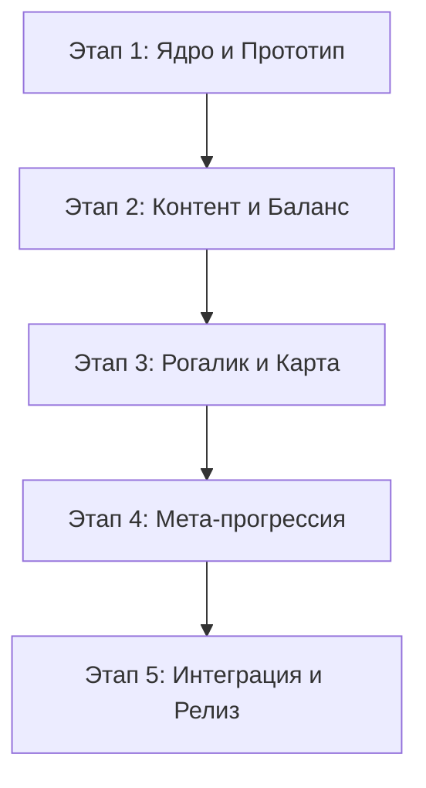

# Roadmap: Arcomage Roguelike (Godot & Yandex Games)

Этот документ представляет собой визуализированный и детализированный план развития проекта, разбитый по ключевым вехам (Milestones).

---

## 🗺️ Обзор этапов

---

## 🚩 Milestone 1: "Первый кирпич" (Недели 1-2)
**Цель:** Рабочий прототип боя между двумя игроками.

*   **1.1 Настройка окружения**
    *   [x] Инициализация Godot 4.3 (Compatibility mode).
    *   [x] Настройка структуры папок (core, entities, data, ui).
    *   [x] Создание JS-заглушки для Yandex SDK.
*   **1.2 Механика боя**
    *   [ ] Стейт-машина матча (MatchManager).
    *   [ ] Система ресурсов и их автоматический прирост.
    *   [ ] Логика карт: стоимость, типы (Бриллианты, Гемы, Звери).
*   **1.3 UI/UX Прототип**
    *   [ ] Простая визуализация Башен и Стен (Progress Bars).
    *   [ ] Базовая сцена карты в руке с текстом и стоимостью.
    *   [ ] Кнопка сброса карты.

---

## 🚩 Milestone 2: "Армия и Магия" (Недели 3-4)
**Цель:** Наполнение игры контентом и реализация противника.

*   **2.1 Контент-пак №1 (Базовый)**
    *   [ ] Реализация 30 базовых карт через `Resource`.
    *   [ ] Добавление эффектов: прямой урон, лечение, воровство ресурсов, бафф генераторов.
*   **2.2 Искусственный интеллект**
    *   [ ] Весовая система оценки карт для ИИ.
    *   [ ] Разные профили ИИ: Агрессор, Защитник, Экономист.
*   **2.3 Визуальные эффекты**
    *   [ ] Анимации появления/исчезновения карт (Tween).
    *   [ ] Эффекты урона (тряска экрана, частицы пыли).

---

## 🚩 Milestone 3: "Путь Героя" (Недели 5-6)
**Цель:** Превращение игры в Roguelike.

*   **3.1 Карта мира**
    *   [ ] Генератор путей (узлы: бой, элита, магазин, событие).
    *   [ ] Логика перемещения игрока по карте.
*   **3.2 Система Артефактов**
    *   [ ] Реализация пассивных бонусов (реликвий).
    *   [ ] Интерфейс выбора награды после боя (1 из 3).
*   **3.3 Экономика забега**
    *   [ ] Золото как валюта внутри забега.
    *   [ ] Магазин карт и удаления ненужных карт из колоды.

---

## 🚩 Milestone 4: "Наследие" (Недели 7-8)
**Цель:** Удержание игрока через мета-прогрессию.

*   **4.1 Глобальная прокачка**
    *   [ ] Заработок мета-валюты после смерти/победы.
    *   [ ] Древо навыков: постоянные бонусы к HP, стартовым ресурсам.
*   **4.2 Система профиля**
    *   [ ] Локальные сохранения и интеграция с `ysdk.player.setData`.
    *   [ ] Система достижений и разблокировки новых стартовых колод.
*   **4.3 UI Финализация**
    *   [ ] Главное меню, экран завершения забега, экран настроек.

---

## 🚩 Milestone 5: "Большая Игра" (Недели 9-11)
**Цель:** Монетизация, оптимизация и запуск на Яндекс Играх.

*   **5.1 Монетизация (Yandex SDK)**
    *   [ ] Интеграция Rewarded Video (второй шанс, бонусное золото).
    *   [ ] Настройка Interstitial между уровнями.
    *   [ ] Реализация IAP (покупка мета-валюты, отключение рекламы).
*   **5.2 Техническая полировка**
    *   [ ] Оптимизация размера бандла (удаление лишних модулей Godot).
    *   [ ] Настройка корректного отображения на мобильных устройствах.
    *   [ ] Реализация паузы при потере фокуса браузера.
*   **5.3 Релиз**
    *   [ ] Подготовка ассетов для магазина (иконки, скриншоты).
    *   [ ] Прохождение модерации Яндекс Игр.

---

## 📊 Матрица рисков

| Риск | Влияние | Решение |
| :--- | :--- | :--- |
| **Баланс** | Высокое | Автоматические тесты боя "ИИ против ИИ" для сбора статистики. |
| **Размер бандла** | Среднее | Использование кастомных сборок Godot и WebP текстур. |
| **IAP не одобрен** | Низкое | Переход на модель монетизации исключительно через Rewarded Video. |
