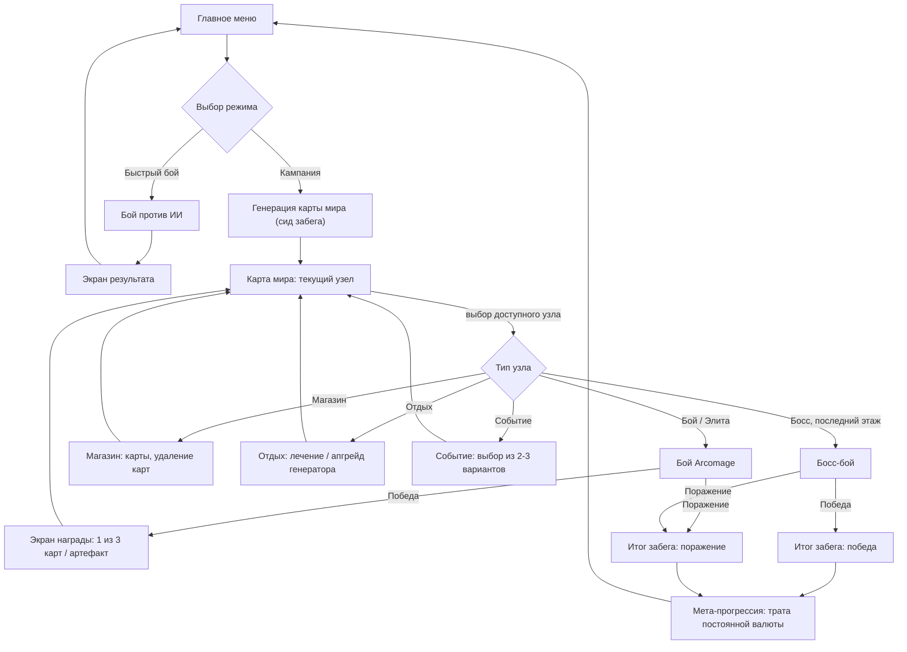
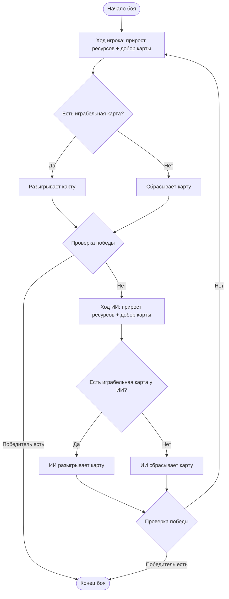
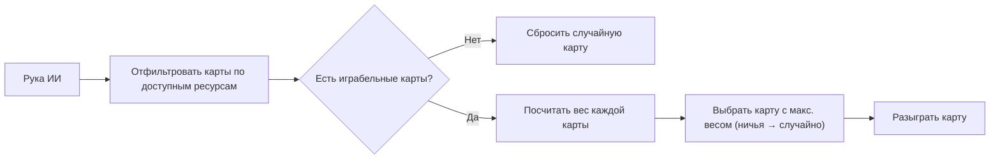
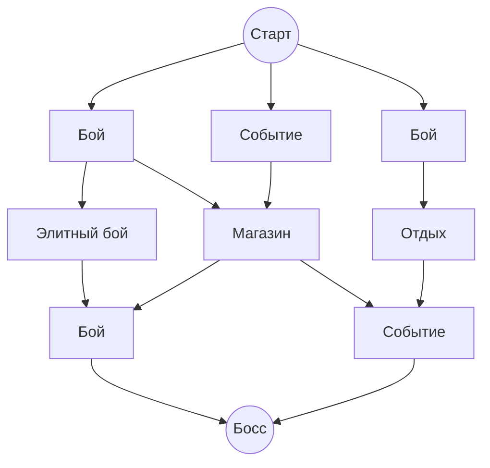

# Game Design Document — «Башни магов: Дуэль»

> Документ собирается поэтапно. Каждый раздел согласован и добавлен по одному юниту за раз.
> Технический бэклог ведётся в GitHub Issues репозитория.

---

## 1. Обзор игры

**Название:** Башни магов: Дуэль
**Жанр:** карточная стратегия с элементами roguelike (deck-building light)
**Платформа:** веб (Яндекс Игры), HTML5, с прицелом на мобильный браузер
**Референсы:** *Arcomage* (мини-игра из Might & Magic — источник боевой механики), *Slay the Spire* (структура забега и карта мира), *Dream Quest* (лёгкость карточного roguelike для казуальной аудитории)

### Elevator pitch

Два соперника — вы и ИИ — одновременно отстраивают свои владения: Стену и Башню. Каждый ход вы разыгрываете карты трёх типов ресурсов (Кирпичи, Гемы, Звери), чтобы либо ускорить свою стройку, либо разрушить постройки врага. Побеждает тот, кто первым отстроит Башню до предела, обнулит Башню противника или накопит гору одного ресурса. Один бой занимает 3–5 минут — а между боями вы поднимаетесь по ветвящейся карте мира, находите новые карты и артефакты, готовясь к финальному боссу.

### Два режима игры

* **Кампания (роглик-забег):** движение по карте мира от старта до босса; между боями — награды, магазины, события; колода и артефакты сохраняются в рамках забега, прогресс — нет (в этом суть roguelike).
* **Быстрый бой:** одиночная случайная схватка против ИИ без карты мира и наград — для тех, кто хочет размяться за 5 минут или проверить новую тактику без риска для забега.

### Уникальное торговое предложение (USP)

* Гонка трёх экономик (Кирпичи/Гемы/Звери) вместо привычного «атака против защиты» — решение всегда в том, расти самому или ломать врага, а не просто в подборе сильных карт.
* Очень короткая единица геймплея (один бой 3–5 минут) идеально ложится на формат веб-игр и мобильные сессии «в перерыве».
* Roguelike-надстройка (карта, реликвии, мета-прогрессия) даёт долгосрочную мотивацию поверх простого и быстро объяснимого боя.

### Тон и настроение

Лёгкое фэнтези без мрачности: каменоломни, гномы, драконы, маги-подмастерья — стилистика ближе к настольной игре/мультфильму, чем к «тёмному» roguelike. Ощущение должно быть «напряжённая гонка стройки», а не «выживание».

---

## 2. Целевая аудитория

### Портрет игрока

* **Основной сегмент:** казуальные игроки платформы Яндекс Игры — заходят из браузера (desktop и mobile web), ищут короткую сессию «на 5–15 минут», не обязательно имеют опыт в карточных играх или roguelike.
* **Вторичный сегмент:** игроки, знакомые с карточными roguelike (*Slay the Spire*, *Dream Quest*) или с оригинальным *Arcomage* — придут за узнаваемой механикой, оценят глубину билдостроения через артефакты и карты.
* **Возраст:** широкий диапазон, типичный для каталога Яндекс Игр (ориентировочно 10+, без возрастных ограничений по контенту — фэнтези без насилия/крови).

### Контекст игры

* Открывают в браузере на паузе/перерыве — сессия должна быть осмысленной уже через 3–5 минут (один бой), без обязательного длинного онбординга.
* Заметная доля трафика — мобильный браузер, поэтому UI обязан быть читаемым и играбельным без мыши (см. раздел 10 и технические ограничения).
* Не предполагается стабильное подключение/аккаунт вне экосистемы Яндекса — прогресс должен переживать закрытие вкладки (облачные сохранения через Yandex SDK).

### Что мотивирует возвращаться

* Классический roguelike-крючок «ещё один забег» — короткие пробежки с разным набором карт/артефактов.
* Мета-прогрессия между забегами (постоянные разблокировки) — ощутимый прогресс, даже если конкретный забег закончился неудачно.
* Быстрый бой как «лёгкий вход» без обязательств — можно зайти на 5 минут, не проходя весь забег.

### Кого мы **не** делаем игру

Не целимся в хардкорную PvP-аудиторию (нет мультиплеера против живых игроков в MVP) и не соревнуемся глубиной билдостроения с полноценными deckbuilder’ами уровня Steam — приоритет отдаётся доступности и коротким сессиям над экспертной глубиной.

---

## 3. Основной игровой цикл забега



### Пояснение по стадиям

1. **Главное меню** — выбор между Кампанией и Быстрым боем (см. раздел 1).
2. **Генерация карты мира** — по сиду строится ветвящийся граф из ~12–15 этажей (детали — раздел 7).
3. **Карта мира** — игрок видит только доступные (соединённые с текущим) узлы; остальные закрыты.
4. **Бой Arcomage** — ядро геймплея, одинаково для обычных, элитных узлов и Быстрого боя, но с разными характеристиками противника (детали — раздел 4).
5. **Магазин / Отдых / Событие** — небоевые узлы, дающие выбор без риска проиграть (детали — раздел 7).
6. **Экран награды** — после победы в бою игрок выбирает 1 из 3 карт или получает артефакт; пул зависит от типа узла.
7. **Босс** — финальный узел карты, усиленный противник; исход завершает забег.
8. **Итог забега** — статистика (пройденные этажи, собранные артефакты) и переход к мете.
9. **Мета-прогрессия** — заработанная за забег постоянная валюта тратится на разблокировки перед следующим забегом (детали — раздел 9).

Колода и артефакты существуют **только в рамках одного забега** — при поражении/победе всё, кроме мета-валюты и разблокировок, обнуляется. Это ключевое roguelike-правило игры.

---

## 4. Боевая система (ядро Arcomage)

### 4.1 Ресурсы и генераторы

Каждый игрок независимо управляет тремя ресурсами. Ресурс не тратится «в никуда» — он превращается либо в рост своих построек, либо в урон по врагу.

| Ресурс | Генератор | Цвет карт | Основное назначение |
| :--- | :--- | :--- | :--- |
| **Кирпичи** | Карьер (Quarry) | Красный | Постройка Стены/Башни, осадные карты по стене врага |
| **Гемы** | Магическая академия (Magic) | Синий | Заклинания — урон по Башне напрямую (игнорируя Стену), служебные эффекты |
| **Звери** | Подземелье (Dungeon) | Зелёный | Существа — урон по Стене/Башне врага, самые «прямолинейные» атакующие карты |

Каждый ход генератор автоматически добавляет игроку ресурс своего типа в размере своего уровня (уровень 1 = +1 ресурса за ход). Уровень генератора можно поднять, разыгрывая соответствующие карты («Каменоломня», «Маг-новичок», «Зверолов» и т.п.).

### 4.2 Башня и Стена

* **Башня (Tower)** — главный показатель игрока. Обнулилась — поражение. Отстроена до предела — победа.
* **Стена (Wall)** — буфер перед Башней. Весь входящий урон сначала поглощает Стена; если урона больше, чем осталось прочности Стены, остаток («overflow») уходит в Башню. Часть карт (заклинания вроде «Огненного шара») бьют **напрямую по Башне**, полностью игнорируя Стену — такие карты дороже и являются главным способом добить противника с высокой Стеной.

**Стартовые значения:** Башня — 20, Стена — 5, все три ресурса — по 5, все три генератора — уровень 1.

### 4.3 Структура хода



Ходы строго чередуются: в начале своего хода игрок получает прирост ресурсов и берёт карту, затем обязан либо сыграть одну карту, либо сбросить одну (если играть нечего — ход не может «зависнуть»). После каждого действия проверяются условия победы, прежде чем передать ход сопернику.

**Лимит руки:** 5 карт. Если рука уже заполнена, новая карта в начале хода не берётся (артефакт «Книга Мудрости» увеличивает лимит до 6 — раздел 8).

### 4.4 Условия победы

Бой заканчивается, как только выполняется любое из условий (проверяется после каждого разыгранного/сброшенного хода):

1. **Строительная победа:** своя Башня достигла высоты 55.
2. **Победа разрушением:** Башня противника упала до 0 или ниже.
3. **Экономическая победа:** один из трёх ресурсов накоплен в количестве 300 и более.

Симметрично те же условия для противника означают поражение игрока.

### 4.5 Что переносится между боями в рамках забега

Каждый бой — самодостаточная партия: Башня, Стена, ресурсы и уровни генераторов **всегда сбрасываются к базовым значениям** (25 / 8 / по 5 / уровень 1) в начале боя, в бою на карте мира, в элитном бою, в бою с боссом и в Быстром бою одинаково. Это принципиально, потому что в игре есть условие «построй Башню до 55» — если бы Стена/Башня переносились между боями как «здоровье» (по аналогии с *Slay the Spire*), первая же строительная победа делала бы все следующие бои забега тривиальными.

Между боями в рамках одного забега переносится не «здоровье», а:

* **Колода** — какие карты можно тянуть в следующем бою (раздел 5, 7);
* **Артефакты** — пассивные бонусы, они переприменяются заново в начале *каждого* боя (например, артефакт «Башня всегда стартует +5» действует в любом бою забега, а не «донашивает» урон из прошлого) (раздел 8);
* **Золото забега** и постоянные усиления, полученные на узлах «Отдых»/«Событие» (раздел 7) — они тоже реализованы как модификаторы, применяемые при старте каждого следующего боя, а не как разовое лечение.

---

## 5. Карты

### 5.1 Анатомия карты

```
┌───────────────────────────┐
│ Дракон                [5] │  ← название карты        стоимость
│ ┌───────────────────────┐ │
│ │                       │ │
│ │      [ ИКОНКА ]       │ │  ← арт карты
│ │                       │ │
│ └───────────────────────┘ │
│ Наносит 8 урона Башне     │  ← описание эффекта
│ врага. Стена врага -5.    │
└───────────────────────────┘
   фон карты подсвечен зелёным = тип «Звери»
   (Кирпичи — красный, Гемы — синий)
```

Цвет фона карты сразу говорит игроку, из какого ресурса её разыгрывать — это единственная подсказка, не требующая чтения текста, поэтому цветовое кодирование должно быть согласовано во всех местах интерфейса (рука, магазин, награда, коллекция).

### 5.2 Категории эффектов

| Категория | Что делает | Примеры |
| :--- | :--- | :--- |
| **Экономика** | Повышает уровень своего генератора | «Каменоломня», «Маг-новичок», «Зверолов» |
| **Строительство** | Увеличивает свою Стену или Башню | «Стена», «Основание», «Укрепление» |
| **Атака по Стене** | Урон, который сначала гасит Стена врага | «Осадное орудие», «Рыцарь», «Волчья стая» |
| **Прямая атака** | Урон напрямую по Башне врага, игнорируя Стену | «Огненный шар», «Метеорит», «Армагеддон» |
| **Утилити** | Добор карт, кража ресурсов врага, условные эффекты («если Стена < 5 — построить 6») | «Ясновидение», «Проклятие», «Резервы» |

### 5.3 Редкость

Редкость определяет, насколько карта уникальна/сильна за свою стоимость и где она встречается (стартовая колода, магазин, награда за обычный/элитный бой, награда за босса).

| Редкость | Характер эффекта | Где встречается |
| :--- | :--- | :--- |
| **Обычная** | Простой, линейный эффект, низкая стоимость | Стартовая колода, магазин, награда за обычный бой |
| **Необычная** | Составной эффект или усиленное значение за стоимость | Магазин, награда за обычный/элитный бой |
| **Редкая** | Уникальный сильный эффект, часто с побочным условием | Награда за элитный бой/босса, мета-разблокировки |

### 5.4 Примеры карт (полный список — в `cards_list.md`)

| Карта | Ресурс | Редкость | Cost | Эффект |
| :--- | :--- | :--- | :--- | :--- |
| Каменоломня | Кирпичи | Обычная | 1 | Генератор Кирпичей +2 |
| Осадное орудие | Кирпичи | Необычная | 3 | 5 урона врагу |
| Великая стена | Кирпичи | Редкая | 7 | Стена +16 |
| Огненный шар | Гемы | Обычная | 2 | 4 урона Башне врага напрямую |
| Армагеддон | Гемы | Редкая | 8 | 16 урона Башне врага напрямую |
| Дракон | Звери | Редкая | 6 | 12 урона Башне + Стена врага −5 |

Эта таблица — только иллюстрация роли/архетипа каждой редкости, не источник точных чисел. Полный список карт,
точные `cost`/эффекты и итоговое количество по каждому типу ресурса — **только** в `cards_list.md` (ARC-024:
эта таблица уже расходилась с фактическими значениями после балансировки ARC-023, поэтому дублировать здесь
точные цифры и общий счётчик карт больше не будем — обновляйте их только в `cards_list.md`).

### 5.5 Философия баланса стоимости

Чем выше `cost`, тем эффект должен расти **нелинейно** (нельзя просто умножать на коэффициент) — дорогие карты обязаны либо комбинировать несколько эффектов, либо игнорировать обычные ограничения (Стену), иначе они проигрывают экономически более дешёвым альтернативам, разыгранным чаще.

---

## 6. Искусственный интеллект противника

### 6.1 Принцип

ИИ не должен быть «непобедимым оптимизатором» — цель в том, чтобы его поведение было **читаемым**: игрок должен за пару ходов понять архетип противника и подстроить тактику. Реализуется через весовую систему: у каждой играбельной карты в руке считается «вес» полезности прямо сейчас, разыгрывается карта с максимальным весом.



### 6.2 Архетипы

| Архетип | Приоритет в весах | Поведение в игре |
| :--- | :--- | :--- |
| **Агрессор** | Урон, особенно прямой по Башне | Давит без оглядки на свою защиту, опасен для игроков с низкой Стеной |
| **Строитель** | Рост своей Стены/Башни, генератор Кирпичей | Играет «в свою игру», может выиграть строительной победой раньше, чем игрок успеет продавить |
| **Маг / Экономист** | Манипуляции ресурсами (Гемы), кража ресурсов врага | Замедляет игрока экономически, а не напрямую в бою |
| **Сбалансированный** (по умолчанию) | Реагирует на ситуацию: защита при низкой Стене, атака при низком HP врага | Универсальный «средний» противник без выраженного перекоса |

### 6.3 Привязка архетипа к типу узла карты

| Узел | Архетип противника |
| :--- | :--- |
| Обычный бой | Случайный архетип, базовые характеристики |
| Элитный бой | Усиленная версия архетипа (выше стартовые HP/генераторы, чуть агрессивнее веса) |
| Босс | Скриптованный гибрид — например, играет от Строителя, но переключается в Агрессора, если чувствует угрозу поражения |
| Быстрый бой | Случайный архетип среднего уровня — для практики без привязки к прогрессу забега |

### 6.4 Масштабирование сложности

Чем дальше игрок продвинулся по карте мира, тем выше стартовые характеристики противника (HP Башни/Стены, уровень генераторов) — сам алгоритм принятия решений не меняется, растёт только «запас прочности» соперника. Это даёт постепенно нарастающее напряжение забега без необходимости придумывать более «умный» ИИ.

---

## 7. Карта мира / роглик-структура

### 7.1 Типы узлов

| Узел | Что происходит | Риск |
| :--- | :--- | :--- |
| **Бой** | Стандартный бой против случайного архетипа ИИ (раздел 6) | Проигрыш = конец забега |
| **Элитный бой** | Усиленный противник, но гарантированно более ценная награда (редкая карта / шанс артефакта) | Выше риск, выше награда |
| **Магазин** | Покупка карт за золото забега, удаление ненужных карт из колоды | Нет боя — только траты |
| **Отдых** | Выбор одного из двух **постоянных на этот забег** усилений — например, «Заложить фундамент» (Башня стартует на +5 в каждом бою) или «Улучшить рудник» (генератор одного ресурса стартует на уровень выше в каждом бою) | Нет боя |
| **Событие** | Текстовая ситуация с 2–3 вариантами выбора и последствиями (ресурсы, золото, карта, постоянное усиление, иногда риск) | Иногда есть риск, зависит от события |
| **Босс** | Финальный узел этажей — сильный скриптованный противник, гарантированная награда-артефакт | Проигрыш = конец забега |

### 7.2 Структура карты

* Карта — ветвящийся граф из **~12–15 этажей**.
* На каждом этаже 2–4 узла; пути ветвятся и иногда сходятся к следующему этажу (по образцу *Slay the Spire*), так что у игрока почти всегда есть выбор из 2 направлений.
* Распределение типов узлов смещено в сторону обычных боёв (это всё-таки боевая игра), с редкими вкраплениями элитных боёв, магазинов, отдыха и событий.
* Последний этаж — всегда **Босс**, путь к нему гарантированно существует из любой точки карты.
* Карта генерируется по **сиду забега** — это нужно и для тестируемости, и потенциально для «дневных забегов» с одинаковой картой для всех игроков (общая идея, не обязательство MVP).

### 7.3 Пример графа карты



### 7.4 Правила перемещения

* Игрок видит **только узлы, соединённые с текущим положением** — остальная карта скрыта/заблокирована, чтобы не превращать выбор в чтение всей карты наперёд.
* Пройденный узел помечается завершённым и больше недоступен для повторного прохождения.
* Возврата назад по карте нет — только движение вперёд к следующему этажу.

---

## 8. Артефакты (реликвии)

### 8.1 Принцип

Артефакт — это пассивный бонус, который игрок получает за забег (награда за бой, гарантированно за элиту/босса, изредка в магазине) и который действует **на протяжении всего оставшегося забега**, во всех последующих боях. В отличие от карт, артефакты не разыгрываются — они просто есть и реагируют на события боя автоматически. Можно нести сразу несколько артефактов, их эффекты складываются.

### 8.2 Триггеры

| Триггер | Когда срабатывает |
| :--- | :--- |
| **В начале боя** | Один раз при старте каждого боя (например, стартовый бонус к генератору) |
| **В начале хода** | Каждый ход владельца артефакта |
| **При розыгрыше карты** | Сразу после того, как владелец сыграл карту (можно фильтровать по типу ресурса карты) |
| **При получении урона** | Когда по Стене/Башне владельца попадает урон |

### 8.3 Финальный набор артефактов (8 штук, полный каталог — в `artifacts_catalog.html`)

> **ARC-024:** это дизайн-таргет, не факт реализации. Фактически на данный момент реализовано 6 из 8 —
> `data/artifacts/*.tres` и GitHub Issues эпика E остаются источником истины по тому, что
> реально есть в игре. **Не реализованы:** Благословение Основателя, Клык Хищника (тикетов на них пока нет).
> **Реализовано иначе, чем здесь:** вместо «Точило Костей» — «Счастливая Монета» (10% шанс, любая карта,
> `pre_play_hooks`, ARC-035); расхождение и причина зафиксированы в блокквоте ARC-035 в
> GitHub Issues.

| Артефакт | Триггер | Эффект |
| :--- | :--- | :--- |
| **Рог Изобилия** | В начале боя | Все три генератора сразу становятся уровня 2 |
| **Благословение Основателя** | В начале боя | Стена +5, Башня +3 сразу при старте |
| **Кирка Гнома** | В начале хода | +1 к приросту Кирпичей сверх обычного дохода |
| **Клык Хищника** | В начале хода | +1 к приросту Зверей сверх обычного дохода |
| **Сфера Маны** | При розыгрыше карты Гемов | Возвращает 1 Гем сверху потраченного |
| **Точило Костей** | При розыгрыше карты Зверей | 20% шанс не потратить ресурсы за эту карту |
| **Шипастая Стена** | При получении урона по Стене | Атакующий получает 2 урона в ответ |
| **Книга Мудрости** | Пассивно (постоянный модификатор) | Лимит карт в руке увеличен до 6 (вместо 5) |

### 8.4 Где выпадают

Обычные бои изредка предлагают артефакт вместо карты в награде; элитные бои и босс — **гарантированно** дают артефакт. Магазин может изредка предлагать артефакт за золото как дорогой лот. В бою артефакты отображаются рядом с показателями Стены/Башни как ряд маленьких иконок с подсказкой при наведении — игрок должен всегда видеть, какие бонусы у него активны.

---

## 9. Мета-прогрессия между забегами

### 9.1 Валюта

Мета-валюта — **«Слава»** — принципиально отдельна от золота забега (раздел 7): золото тратится и обнуляется внутри одного забега, Слава сохраняется всегда. Слава начисляется по итогам **каждого** забега (и победного, и проигранного) — по формуле, учитывающей число пройденных этажей, побеждённых элит и итоговый исход (победа над боссом даёт больше всего).

### 9.2 На что тратится Слава

| Ветка улучшений | Что даёт | Пример |
| :--- | :--- | :--- |
| **Основание** | Постоянные бонусы к стартовым показателям во **всех** будущих забегах | «+5 к стартовой Башне», «+1 к стартовой Стене» |
| **Мастерство ресурсов** | Постоянное усиление эффектов определённого типа карт | «Карты Зверей наносят на 10% больше урона» |
| **Открытия** | Разблокировка более сильных карт/артефактов в пулы наград и магазина | Открыть «Дракон», «Армагеддон» и т.п. для выпадения |

Каждое улучшение имеет несколько уровней с растущей стоимостью — это единственная **долгосрочная** прогрессия в игре (в отличие от колоды/артефактов, которые всегда обнуляются между забегами).

### 9.3 Статистика и достижения

Отдельный экран профиля показывает: число побед, максимальную достигнутую высоту Башни, количество завершённых забегов, список открытых карт/артефактов. Это не влияет на геймплей напрямую, но даёт ощущение прогресса и повод для короткого «а как у меня дела».

### 9.4 Сохранение

Профиль (Слава, разблокировки, статистика) сохраняется в облако через Yandex Player Data — прогресс не теряется при смене устройства или очистке браузера (насколько это возможно в рамках экосистемы Яндекс Игр).

---

## 10. Экраны и UI/UX

Визуальные wireframe-макеты всех экранов ниже собраны в отдельном файле `ui_wireframes.html` (открывается в браузере) — здесь приводится их обоснование и текстовое описание компоновки.

### 10.1 Главное меню

Фоновый арт на весь экран: две башни (силуэты игрока слева и противника справа) на фоне заката — визуальная метафора всей игры, читается ещё до объяснения правил. Поверх арта — полупрозрачная панель кнопок в левом нижнем углу (крупные, тач-friendly зоны), а не по центру экрана, чтобы не перекрывать арт.

* **Продолжить** — задизейблена/скрыта, если нет сохранённого незавершённого забега (раздел 7).
* **Кампания** — начать новый roguelike-забег.
* **Быстрый бой** — режим без карты мира (раздел 1).
* **Колода** — коллекция карт/артефактов и статистика (раздел 9).
* Шестерёнка настроек и версия сборки — в правом верхнем углу, не мешают основному вниманию на арт и кнопки.

См. макет: `ui_wireframes.html#main-menu`.

### 10.2 Карта мира

Карта скроллится вертикально снизу вверх (как в *Slay the Spire*): внизу — путь, который игрок уже прошёл, наверху — цель (Босс). Видны только пройденный путь и следующий доступный шаг, а не вся карта целиком — так выбор направления не превращается в чтение наперёд.

* **Топ-бар:** номер текущего этажа из общего числа, золото забега, кнопка быстрого доступа к колоде/артефактам без ухода с карты.
* **Текущий узел** — выделен кольцом-подсветкой.
* **Доступные узлы следующего этажа** — светлая рамка, кликабельны.
* **Пройденные узлы** — приглушены, помечены галочкой, повторный вход невозможен.
* **Иконки типов узлов:** ⚔ бой · 💀 элита · 🛒 магазин · 🔥 отдых · ❓ событие · 🐉 босс — единая иконография используется также в награде (10.4) и легенде.
* Босс виден заранее издалека (мотивирующий ориентир), даже если до него ещё много этажей.

См. макет: `ui_wireframes.html#world-map`.

### 10.3 Боевой экран

Главный экран игры — на нём проходит весь бой (раздел 4). Компоновка зеркальная: противник сверху, игрок снизу, оба «растут» навстречу друг другу к центру экрана.

* **Стена/Башня визуализируются не только числом и прогресс-баром, но и стопкой растущих блоков** — физически видно, как постройки приближаются друг к другу по мере боя. Эта деталь уже частично реализована в коде и должна быть сохранена как фирменная фишка визуализации.
* **Ресурсы** каждого игрока показаны с приростом за ход (например, «🧱 9 (+1)»), чтобы решение «копить или тратить» было наглядным без подсчётов в уме.
* **Крупный статус-индикатор хода** по центру экрана («ХОД ИГРОКА» / «ХОД ПРОТИВНИКА») — исключает путаницу, чей сейчас ход.
* **Артефакты** — компактный ряд иконок у каждого игрока с подсказкой при наведении (раздел 8).
* **Рука с картами** — снизу экрана; карты, на которые не хватает ресурсов, **визуально притушены**, а не только «трясутся» при неудачном клике — игрок сразу видит, что доступно к розыгрышу.

См. макет: `ui_wireframes.html#battle-screen`.

### 10.4 Экран награды

Показывается сразу после победы в бою на карте мира (перед возвратом на карту, раздел 3, ARC-002/ARC-015 в техническом бэклоге).

* **Три слота награды**, использующие тот же макет карточки, что и в разделе 5 (анатомия карты) — узнаваемость важнее новизны интерфейса.
* Один из трёх слотов может оказаться **артефактом** вместо карты (выделен золотой рамкой, раздел 8) — шанс зависит от типа узла: обычный бой — редко, элитный бой/босс — гарантированно.
* **«Пропустить»** — осознанный отказ от всех вариантов; тонкая, сфокусированная колода — тоже валидная стратегия, а не только «бери всё подряд».
* **«На карту»** — подтверждает выбор (или пропуск) и возвращает на экран карты мира (10.2), продолжая забег.

См. макет: `ui_wireframes.html#reward-screen`.

### 10.5 Магазин

Два раздела на одном экране, без переключения вкладок:

* **Купить карты** — 3–5 карт за золото забега, обновляется при каждом посещении.
* **Удалить карту из колоды** — вся текущая колода видна списком, клик по карте убирает её за отдельную плату. Это единственный способ «почистить» колоду от слабых карт, взятых ранее в наградах (раздел 7).

Золото забега всегда отображается в шапке — решения принимаются с полной информацией без переходов между экранами. Кнопка «Уйти на карту» возвращает на экран 10.2 в любой момент.

См. макет: `ui_wireframes.html#shop-screen`.

### 10.6 Профиль / мета-прогрессия

Три вкладки на одном экране:

* **Прокачка** — постоянные улучшения за Славу, три колонки по веткам из раздела 9.2 (Основание / Мастерство ресурсов / Открытия), у каждого узла виден текущий уровень и стоимость следующего.
* **Статистика** — побед, максимальная достигнутая высота Башни, число завершённых забегов (раздел 9.3).
* **Коллекция** — все когда-либо открытые карты и артефакты; ещё не разблокированные показаны силуэтом с иконкой замка — так игрок видит цель, к которой стремится, даже до открытия.

Слава всегда отображается в шапке рядом с названием экрана. «Назад в меню» возвращает на экран 10.1.

См. макет: `ui_wireframes.html#profile-screen`.

Этим набором закрывается раздел 10 — все ключевые экраны игры имеют текстовое описание и визуальный wireframe.

---

## 11. Арт-стиль и звук

### 11.1 Визуальный стиль

Стилизованная 2D-фэнтезийная графика, ближе к *Clash Royale* и карточным фреймам *Hearthstone*, чем к мрачному fantasy-арту — насыщенные, но не кричащие цвета, чистые читаемые силуэты (иконка карты и башни должны опознаваться даже в маленьком размере на мобильном экране). Никакой крови/расчленёнки — соответствует широкой аудитории без возрастных ограничений (раздел 2).

### 11.2 Цветовой язык

Цветовое кодирование ресурсов, заданное в разделе 5 (Кирпичи — красный, Гемы — синий, Звери — зелёный), должно быть **единым во всех местах интерфейса**: карты, HUD, иконки узлов карты мира, частицы эффектов. Это единственный невербальный ориентир игрока — нарушать его нельзя даже ради «красивого» арта отдельного экрана.

### 11.3 Арт карт и мира

* Одна центральная иллюстрация на карту, единый ракурс/обрамление (см. макет карты, раздел 5.1).
* Карта мира — фон в духе «нарисованная пергаментная карта королевства», иконки узлов простые и контрастные (раздел 10.2).
* Главное меню — единственное место с полноценной «героической» иллюстрацией на весь экран (две башни, раздел 10.1) — задаёт тон всей игре с первого кадра.

### 11.4 Анимация и VFX

Анимации через `Tween` должны быть быстрыми и «сочными», но не отвлекать от чтения чисел: розыгрыш карты, партиклы урона/строительства, тряска экрана — умеренно и только в значимые моменты (не на каждое мелкое событие).

### 11.5 Звук

* **Музыка:** зацикленные фэнтезийные темы, отдельно для меню/карты/обычного боя/босса (у босса — заметно интенсивнее); короткие стингеры на победу/поражение.
* **SFX по типу ресурса:** глухой стук камня (Кирпичи), звонкая магическая нота (Гемы), рык/рёв (Звери) — при розыгрыше карты игрок должен «слышать» тип ресурса не глядя на цвет.
* **SFX ударов:** отдельно звук трещины по Стене и более тяжёлый гул по Башне — подкрепляет визуальную механику раздела 4.2.
* Аудио уважает политику автовоспроизведения браузеров (звук включается по первому взаимодействию) и регулируется в экране настроек (раздел 10, ARC-042 в техническом бэклоге).

---

## 12. Монетизация и интеграция с Яндекс Играми

### 12.1 Принцип

Реклама и покупки не должны ощущаться обязательными или наказывающими — базовый цикл игры (раздел 3) полностью проходим бесплатно и без рекламы. Монетизация — это **опциональное ускорение/расширение**, а не плата за доступ к контенту.

### 12.2 Rewarded video (по инициативе игрока)

| Точка интеграции | Что даёт |
| :--- | :--- |
| **«Второе дыхание»** | При поражении в бою — предложение посмотреть рекламу, чтобы продолжить этот же бой с частично восстановленной Стеной/Башней (не автопобеда, а второй шанс) |
| **Удвоение золота забега** | После победы в бою — предложение удвоить полученное золото за просмотр |
| **Бесплатный артефакт** | В магазине (раздел 10.5) — один артефакт можно получить за рекламу вместо золота |

Реклама этого типа всегда **по явному запросу игрока**, никогда не показывается сама.

### 12.3 Interstitial (между сессиями)

Показывается не чаще одного раза в 2–3 минуты игрового времени, только в переходных точках (между боем и картой мира, между забегами) — никогда посреди боя или экрана выбора награды/магазина, чтобы не прерывать принятие решений.

### 12.4 Sticky banner

Небольшой баннер в главном меню и на карте мира — не показывается в бою, чтобы не отвлекать от боевого HUD и не занимать место на маленьких мобильных экранах в решающий момент.

### 12.5 Внутриигровые покупки (IAP)

* **Наборы Славы** (раздел 9) — для игроков, которые хотят ускорить мета-прогрессию без гринда.
* **Starter Pack** — разовый набор: артефакт + запас Славы + отключение Interstitial (Rewarded остаётся, так как он опционален и выгоден игроку).
* **Косметика** (более поздний этап) — облики Башен и рубашки карт, чисто визуальные, не влияют на баланс.

### 12.6 Техническая интеграция

Все точки выше реализуются через Yandex Games SDK (`ysdk.adv`, `ysdk.payments`, `ysdk.player`) — детали инициализации и обработки колбэков находятся в GitHub Issues эпика H.

---

## 13. Технические ограничения платформы

Эти ограничения не «пожелания», а обязательные условия для публикации и нормальной работы на Яндекс Играх — их нарушение либо не пройдёт модерацию, либо испортит опыт большей части аудитории (раздел 2).

| Ограничение | Требование | Почему |
| :--- | :--- | :--- |
| **Многопоточность** | Отключена (Threads: OFF) | Обязательное требование платформы Яндекс Игр для HTML5-сборок |
| **Вес сборки** | Минимизировать (ориентир — как можно ближе к single-digit МБ, реалистичная цель уточняется по факту первой сборки) | Игроки заходят из браузера/мобильной сети, долгая загрузка = отток до первого боя |
| **Рендерер** | Compatibility/GLES3, без Forward+ и лишних 3D-модулей | Игра полностью 2D — 3D-физика и продвинутый рендер только раздувают бандл (см. GitHub Issue ARC-007) |
| **Пауза при потере фокуса** | Обязательна | Игрок может свернуть вкладку в середине хода — бой не должен продолжаться без него |
| **Сохранения** | Через `ysdk.player`, с локальным fallback | Нельзя полагаться только на локальное хранилище браузера — оно может очищаться |
| **Сигнал готовности** | `ysdk.features.LoadingAPI.ready()` после отрисовки первого экрана | Требование платформы для корректного скрытия своего лоадера |
| **Мобильная адаптация** | Отклик на разные соотношения сторон, крупные тач-зоны (раздел 2, 10) | Значительная доля трафика — мобильный браузер |
| **Сжатие текстур** | WebP/VRAM-сжатие для арта | Прямое влияние на вес сборки и скорость загрузки |

Технические детали реализации (экспорт-пресеты, конкретные тикеты) — в GitHub Issues эпиков A и H.

---

## 14. Глоссарий терминов

| Термин | Значение | Раздел |
| :--- | :--- | :--- |
| **Забег** | Одно прохождение Кампании от старта карты мира до победы/поражения; всё, кроме Славы и разблокировок, обнуляется по завершении | 3 |
| **Узел** | Точка на карте мира: Бой, Элитный бой, Магазин, Отдых, Событие или Босс | 7 |
| **Этаж** | Один «уровень» карты мира, содержащий 2–4 узла | 7 |
| **Башня / Стена** | Основной и буферный показатели игрока в бою; Стена поглощает урон до Башни | 4 |
| **Генератор** (Карьер / Магическая академия / Подземелье) | Источник автоматического прироста ресурса за ход | 4 |
| **Прямая атака** | Тип урона, игнорирующий Стену и бьющий сразу по Башне | 4, 5 |
| **Строительная / экономическая победа / победа разрушением** | Три альтернативных условия победы в бою | 4 |
| **Архетип ИИ** | Один из профилей поведения противника: Агрессор, Строитель, Маг/Экономист, Сбалансированный | 6 |
| **Артефакт** | Пассивный бонус, действующий весь оставшийся забег | 8 |
| **Золото (забега)** | Временная валюта внутри одного забега, тратится в Магазине | 7, 9 |
| **Слава** | Постоянная мета-валюта, не сбрасывается между забегами | 9 |
| **Кампания / Быстрый бой** | Два режима игры: roguelike-забег с картой и одиночный бой без неё | 1 |
| **Rewarded video / Interstitial** | Реклама по запросу игрока / реклама между сессиями с ограничением частоты | 12 |
